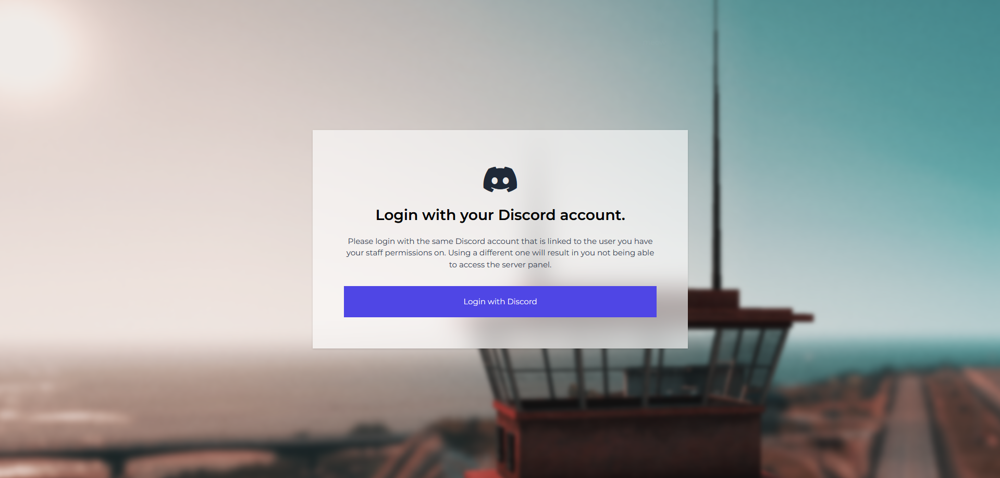
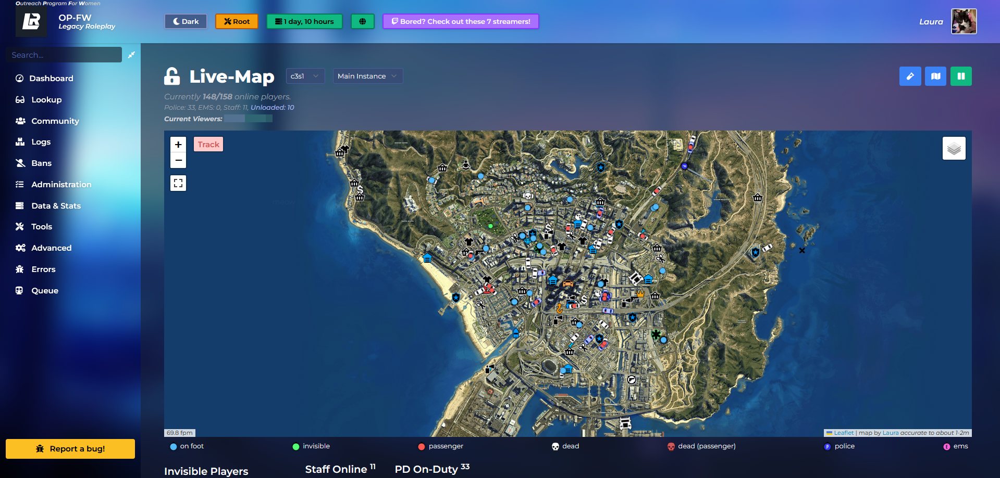

<p align="center">
    <a href="https://legacy-roleplay.com" target="blank">
        
    </a>
</p>

<h1 align="center">
    opfw-admin
</h1>

<strong>100% FREE + OPEN SOURCE.</strong>

> An admin panel for OP-Framework servers. Written in PHP using [Laravel Framework](https://laravel.com/) and
> [Tailwindcss](https://tailwindcss.com) for the frontend.

See [#contributing](#Contributing) for more details on how you can help shape the **opfw-admin** panel. We're always down to improve and receive feedback.

## Note
This admin panel **requires** an OP-Framework powered FiveM server. It will **NOT** work with any other server or framework (like ESX, QB-Core, etc.).

## Features
* See and search various detailed server logs.
* See, search, manage and edit players and characters.
* Warn and ban players, also temporarily.
* Watch players on the live-map.
* Keep up-to-date with, edit and delete twitter posts.
* Check all kinds of server statistics.
* And many, many more features...
* [*... open issue to request a feature.*](https://github.com/coalaura/opfw-admin/issues/new/choose)

## License
Please refer to [LICENSE.md](https://github.com/coalaura/opfw-admin/blob/master/LICENSE.md) for this project's license.

## Contributors
This list only contains some of the most notable contributors. For the full list, refer to [GitHub's contributors graph](https://github.com/coalaura/opfw-admin/graphs/contributors).
* [ExpDev07](https://github.com/ExpDev07) (Marius) - Original creator. *No longer works on this project.*
* [coalaura](https://github.com/coalaura) (Laura) - Maintainer of both frontend and backend.

## Pictures

### Logging in


### Dashboard


### Viewing player


### Viewing character


### Live-Map


### Statistics


### And much more...

## Contributing
This section describes how you can help contribute.

### Prerequisites
* An OP-Framework server.
* PHP 8.0+.
* Composer.
* Node (and npm).
* MySQL/MariaDB (database).
* Optimally nginx

### Setting up project
Install php and composer:
```bash
# Add the php repository
add-apt-repository ppa:ondrej/php

# Install PHP and dependencies (should be all i think)
apt install php8.2 php8.2-cli php8.2-simplexml php8.2-dom php8.2-curl php8.2-gmp php8.2-mysql php8.2-gd php8.2-mbstring php8.2-imagick -y
apt install php8.2-fpm -y

# Install composer
php -r "copy('https://getcomposer.org/installer', 'composer-setup.php');"
php composer-setup.php
php -r "unlink('composer-setup.php');"
mv composer.phar /usr/local/bin/composer
```

Grab yourself a copy of this repository:
```bash
$ git clone https://github.com/coalaura/opfw-admin.git
```

Install all the required dependencies (we use both npm and composer):
```bash
$ composer install
$ npm install
```

Create a new file called ``envs/c1/.env`` and copy the contents from ``.env.example`` over to it, then apply your configurations. (Replace "c1" with your cluster)
```bash
$ cp .env.example envs/c1/.env
```

Create a private and unique application key:
```bash
$ php artisan key:generate
```

Run database migrations so that we can store things (Replace "c1" with your cluster):
```bash
$ php artisan migrate --cluster=c1
```

Create a symbolic link at **public/storage** so that it points to **storage/app/public**:
```bash
$ php artisan storage:link
```

Install, configure and run the socket server from [admin-panel-socket](https://github.com/coalaura/admin-panel-socket)

Compile frontend assets (use "dev" for development and "prod" for production):
```bash
$ npm run dev/prod
```

Set up a cron job to be ran every 2 hours (Edit cron.sh to fit your setup):
```bash
0 */2 * * * bash /var/www/opfw-admin/cron.sh > /var/log/opfw_cron.log/var/log/opfw_cron.log
```

Finally, set up nginx:
```nginx
server {
    # Replace this with your domain, important is that the subdomain is the exact same as your cluster.
    # The panel uses the subdomain to determine what .env file should be used.
    server_name c1.legacy-roleplay.com;

    # Change this to point to the "public" folder inside the opfw-admin repository
    root /path/to/opfw-admin/public;

    index index.php index.html index.htm;

    location / {
        try_files $uri $uri/ /index.php$is_args$args;
    }

    # This would be the socket server's configuration.
    # If you are not running it on the standard port you will have to change it here.
    location ~ ^/(socket|io|panel_chat) {
        proxy_pass http://127.0.0.1:9999;
        proxy_http_version 1.1;
        proxy_set_header Upgrade $http_upgrade;
        proxy_set_header Connection "Upgrade";
        proxy_set_header Host $host;
    }

    location ~ ^/_data {
        expires 30d;
        add_header Pragma "public";
        add_header Cache-Control "public";
    }

    # If you are not using php8.2 you need to replace "php8.2-fpm" with the correct version
    location ~ \.php$ {
        fastcgi_split_path_info ^(.+\.php)(/.+)$;
        fastcgi_pass unix:/run/php/php8.2-fpm.sock;
        fastcgi_index index.php;
        include fastcgi.conf;
    }

    # This is depending on how you are setting up ssl certificates.
    # This example would be using lets-encrypt.
    listen 443 ssl;

    ssl_certificate /etc/letsencrypt/live/c1.legacy-roleplay.com/fullchain.pem;
    ssl_certificate_key /etc/letsencrypt/live/c1.legacy-roleplay.com/privkey.pem;
    include /etc/letsencrypt/options-ssl-nginx.conf;
    ssl_dhparam /etc/letsencrypt/ssl-dhparams.pem;
}
```
